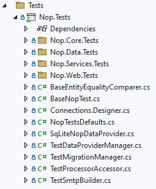
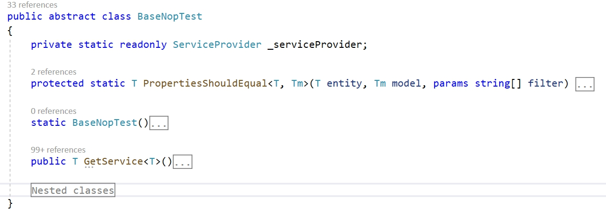

# UNIT testing

I think everyone cnow about the concept of UNIT tests, we know what they are used for and agree that this is an important part of the process of developing reliable software. In this article, we will not touch on these issues, you can easily find all the necessary information on the Internet, for example, by following the links:

* [https://en.wikipedia.org/wiki/Unit_testing](https://en.wikipedia.org/wiki/Unit_testing)
* [https://docs.microsoft.com/dotnet/core/testing/unit-testing-best-practices](https://docs.microsoft.com/dotnet/core/testing/unit-testing-best-practices)
* [https://en.wikipedia.org/wiki/Test-driven_development](https://en.wikipedia.org/wiki/Test-driven_development)

In this article, we will get acquainted with the features of testing in the nopCommerce project, learn how to add our tests and check their performance. We will not test an abstract task, but will write a full-fledged test for the existing functionality from scratch (you can see the result in the form of a commit)

## Features overview



In the screenshot, we see the current structure of the test project. It's not difficult to deal with it, the correspond directories we colate tests of specific assemblies of the solutions, the rest of the files are responsible for the auxiliary and base classes. Especially now we will be interested in the ``BaseNopTest`` class, since it will help us in our task.

### BaseNopTest

This is the main abstract class that exposes the IoC container for tests, and allows us all the advantages of DI.



As you can see from the screenshot, this class contains a lot of code (about 500 lines), but few methods are available for child classes. More precisely, two methods are the protected method ``PropertiesShouldEqual`` that compares all fields of the database entity with the fields of the model. And the ``GetService`` method allows us to use the advantages of DI and relieves us of the work of creating the classes necessary for testing. The initialization of the **IoC** container content is carried out in the static constructor of the class; it is this constructor that contains the bulk of the code.

## IScheduleTaskService

As an example, we will develop tests for a class that implements the ``IScheduleTaskService`` interface.

```csharp
public partial interface IScheduleTaskService
{
    System.Threading.Tasks.Task DeleteTaskAsync(ScheduleTask task);

    Task<ScheduleTask> GetTaskByIdAsync(int taskId);

    Task<ScheduleTask> GetTaskByTypeAsync(string type);

    Task<IList<ScheduleTask>> GetAllTasksAsync(bool showHidden = false);

    System.Threading.Tasks.Task InsertTaskAsync(ScheduleTask task);

    System.Threading.Tasks.Task UpdateTaskAsync(ScheduleTask task);
}
```

As you can see, this is a simple interface, but at the same time, working with scheduled tasks (some of which perform very important tasks, for example, sending email messages to users) depends on its correct operation. Next, we will write tests for each of the methods, stopping, if necessary, on a specific implementation.

> [!NOTE]
> We do not promote or use **TDD**, the reliability of the functionality is important for us, and not a specific approach to testing. But we are not against this approach.

## ScheduleTaskServiceTests class

Add a new ``ScheduleTaskServiceTests`` class to the tests project (Nop.Tests\Nop.Services.Tests\Tasks), its code is shown below:

```csharp
using NUnit.Framework;

namespace Nop.Tests.Nop.Services.Tests.Tasks
{
    [TestFixture]
    public class ScheduleTaskServiceTests : ServiceTest
    {
    }
}
```

This is our class skeleton for testing, from this code we can see that nopCommerce uses the **NUnit framework** to organize tests.
There are two points to pay attention to:

1. Our class has the **TestFixture** attribute, which tells the engine that this class is a class with tests
1. We do not directly inherit the ``BaseNopTest`` class, but another abstract class - ``ServiceTest``, which adds the main plugins to the configuration.

The next step is to add a method for the initial initialization of our tests. As a rule, such a method is called **SetUp**. In this method, we get an instance of a class that implements the ``IScheduleTaskService`` interface, which we will test.

```csharp
private IScheduleTaskService _scheduleTaskService;

[OneTimeSetUp]
public void SetUp()
{
    _scheduleTaskService = GetService<IScheduleTaskService>();
}
```

As you can see, the **SetUp** method should be documented with the **OneTimeSetUp** attribute, also you may use the **SetUp** attribute. The difference between these two attributes is only in the number of calls to the method itself: in the first case, the **SetUp** method is called once for all tests, and in the second, for each test separately.

Next, let's add tests for CRUD methods, in this service these are methods such as: **InsertTaskAsync**, **GetTaskByIdAsync**, **UpdateTaskAsync**, **DeleteTaskAsync**

But first, let's add one more field to the class, this will be an instance of the ``ScheduleTask`` class with which we will conduct testing.

```csharp
 private ScheduleTask _task;
 ```

New code of **SetUp** method:

 ```csharp
 [OneTimeSetUp]
public void SetUp()
{
    _scheduleTaskService = GetService<IScheduleTaskService>();

    _task = new ScheduleTask { Enabled = true, Name = "Test task", Seconds = 60, Type = "nop.test.task" };
}
```

All CRUD testing methods are given below, and as you can see, there is nothing complicated in them:

```csharp
#region CRUD tests

[Test]
public async System.Threading.Tasks.Task CanInsertAndGetTask()
{
    _task.Id = 0;
    await _scheduleTaskService.InsertTaskAsync(_task);
    var task = await _scheduleTaskService.GetTaskByIdAsync(_task.Id);
    await _scheduleTaskService.DeleteTaskAsync(_task);

    _task.Id.Should().NotBe(0);
    task.Id.Should().Be(_task.Id);
    task.Name.Should().Be(_task.Name);
}

[Test]
public void InsertTaskShouldRaiseExceptionIfTaskIsNull()
{
    Assert.Throws<AggregateException>(() =>
            _scheduleTaskService.InsertTaskAsync(null).Wait());
}

[Test]
public async System.Threading.Tasks.Task GetTaskByIdShouldReturnNullIfTaskIdIsZero()
{
    var task = await _scheduleTaskService.GetTaskByIdAsync(0);
    task.Should().BeNull();
}

[Test]
public async System.Threading.Tasks.Task GetTaskByIdShouldReturnNullIfTaskIdIsNotExists()
{
    var task = await _scheduleTaskService.GetTaskByIdAsync(int.MaxValue);
    task.Should().BeNull();
}

[Test]
public async System.Threading.Tasks.Task CanUpdateTask()
{
    _task.Id = 0;
    await _scheduleTaskService.InsertTaskAsync(_task);
    var task = await _scheduleTaskService.GetTaskByIdAsync(_task.Id);
    task.Name = "new test name";
    await _scheduleTaskService.UpdateTaskAsync(task);
    var task2 = await _scheduleTaskService.GetTaskByIdAsync(_task.Id);
    await _scheduleTaskService.DeleteTaskAsync(_task);

    task.Id.Should().Be(task2.Id);
    task2.Name.Should().NotBe(_task.Name);
}

[Test]
public void UpdateTaskShouldRaiseExceptionIfTaskIsNull()
{
    Assert.Throws<AggregateException>(() =>
        _scheduleTaskService.UpdateTaskAsync(null).Wait());
}

public async System.Threading.Tasks.Task CanDeleteTask()
{
    _task.Id = 0;
    await _scheduleTaskService.InsertTaskAsync(_task);
    await _scheduleTaskService.DeleteTaskAsync(_task);
    var task = await _scheduleTaskService.GetTaskByIdAsync(_task.Id);
    task.Should().BeNull();
}

[Test]
public void DeleteTaskShouldRaiseExceptionIfTaskIsNull()
{
    Assert.Throws<AggregateException>(() =>
        _scheduleTaskService.DeleteTaskAsync(null).Wait());
}

#endregion
```

In addition, the list of connected namespaces has changed, the new list is given below:

```csharp
using System;
using FluentAssertions;
using Nop.Core.Domain.Tasks;
using Nop.Services.Tasks;
using NUnit.Framework;
```

> [!NOTE]
> Please note that we delete all changes from the database before testing, because if the test fails, the database will contain data that can affect testing in other parts of the project or in other test methods.

Now let's add testing the remaining two methods:

```csharp
[Test]
public async System.Threading.Tasks.Task CanGetTaskByType()
{
    _task.Id = 0;
    var task = await _scheduleTaskService.GetTaskByTypeAsync(_task.Type);
    task.Should().BeNull();
    await _scheduleTaskService.InsertTaskAsync(_task);
    task = await _scheduleTaskService.GetTaskByTypeAsync(_task.Type);
    await _scheduleTaskService.DeleteTaskAsync(_task);
    task.Should().NotBeNull();
}

[Test]
public async System.Threading.Tasks.Task GetTaskByTypeShouldReturnNullIfTypeIsNull()
{
    var task = await _scheduleTaskService.GetTaskByTypeAsync(null);
    task.Should().BeNull();
}

[Test]
public async System.Threading.Tasks.Task GetTaskByTypeShouldReturnNullIfTypeIsEmpty()
{
    var task = await _scheduleTaskService.GetTaskByTypeAsync(string.Empty);
    task.Should().BeNull();
}

[Test]
public async System.Threading.Tasks.Task CanGetAllTasks()
{
    _task.Id = 0;
    var tasks = await _scheduleTaskService.GetAllTasksAsync(true);
    tasks.Count.Should().Be(0);
    tasks = await _scheduleTaskService.GetAllTasksAsync(false);
    tasks.Count.Should().Be(0);

    await _scheduleTaskService.InsertTaskAsync(_task);
    var tasksWithHidden = await _scheduleTaskService.GetAllTasksAsync(true);
    var tasksWitoutHidden = await _scheduleTaskService.GetAllTasksAsync(false);
    await _scheduleTaskService.DeleteTaskAsync(_task);

    tasksWithHidden.Count.Should().Be(1);
    tasksWitoutHidden.Count.Should().Be(1);

    _task.Enabled = false;

    await _scheduleTaskService.InsertTaskAsync(_task);
    tasksWithHidden = await _scheduleTaskService.GetAllTasksAsync(true);
    tasksWitoutHidden = await _scheduleTaskService.GetAllTasksAsync(false);
    await _scheduleTaskService.DeleteTaskAsync(_task);
    _task.Enabled = true;

    tasksWithHidden.Count.Should().Be(1);
    tasksWitoutHidden.Count.Should().Be(0);
}
```

Finally, let's add one more standard method for many tests, which is usually called **TearDown**. In it, we will carry out the final cleaning of the database from possible changes made by us during the testing process. This method must have an **OneTimeTearDown** or **TearDown** attribute, similar to the attributes of the SetUp method.

```csharp
[OneTimeTearDown]
public async System.Threading.Tasks.Task TearDown()
{
    var tasks = await _scheduleTaskService.GetAllTasksAsync(true);

    foreach (var task in tasks.Where(t=>t.Type.Equals(_task.Type, StringComparison.InvariantCultureIgnoreCase))) 
        await _scheduleTaskService.DeleteTaskAsync(task);
}
```

That's it, our test class is ready. As I promised at the beginning, you can find the entire class at [this link](https://github.com/nopSolutions/nopCommerce/blob/develop/src/Tests/Nop.Tests/Nop.Services.Tests/Tasks/ScheduleTaskServiceTests.cs) and the commit with its addition by [this link](https://github.com/nopSolutions/nopCommerce/commit/81c31e1ee754f771ddfdc26e9b95a729e38b2d29).
