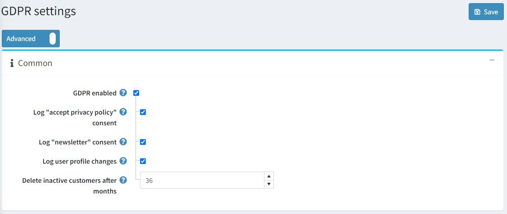

# GDPR settings

*GDPR* (General Data Protection Regulation) is a revised European Union's new data privacy law which impacts how all companies collect, use, and share the personal data of their European customers. The regulation entered into force on May 24, 2016, and applies since May 25, 2018. The regulation is an essential step to strengthen individuals' fundamental rights in the digital age and facilitate business by clarifying rules for companies and public bodies in the digital single market.

For more information, please refer to this source:

[https://ec.europa.eu/info/law/law-topic/data-protection/data-protection-eu_en](https://ec.europa.eu/info/law/law-topic/data-protection/data-protection-eu_en)

## Configure GDPR

To enable GDPR settings in your nopCommerce store, go to **Administration → Configuration → Settings → GDPR settings**.

Then tick the **GDPR enabled** checkbox. Additional settings will allow you to capture a log of the following activities:

* **Log "accept privacy policy" consent**.
* **Log "newsletter" consent**.
* **Log user profile changes**.

You can add consents on your nopCommerce site by clicking the **Add consent** button in the *Consents* panel:

To add a new consent, you will be redirected to the *Add consent* window:

Define the following consent settings:

* **Message** or question that will be displayed to customers.
* Whether the consent **Is required**.
* Whether the consent will be **Displayed during registration**.
* Whether the consent will be **Displayed on "customer info" page** in the "My account" section.
* **Display order** is the consent display order. 1 represents the first item in the list.

Here is an example of a consent option on a customer info page:

If you have enabled the consent log settings, then you can see the log activity by going to: **Administration → Customers → GDPR requests (log)**.

When the GDPR setting is enabled, the store owner can also perform actions like:

* **Permanent delete** for deletion of a customer record.
* **Export data** for exporting customer data.

To do this, go to **Administration → Customers → Edit customer** page.

## Tutorials

* [Managing GDPR settings in nopCommerce](https://www.youtube.com/watch?v=6bLc_TDqD18&feature=youtu.be)
