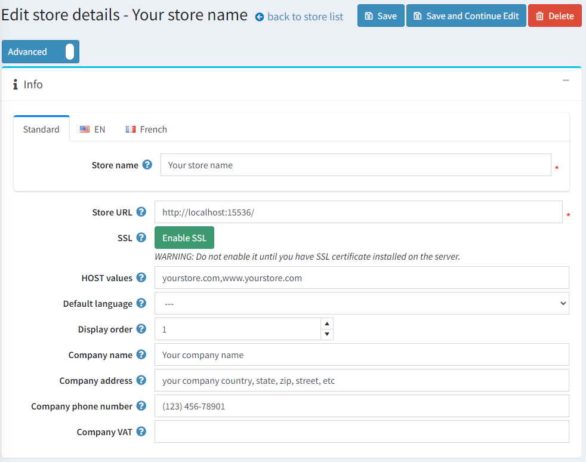

# Your store information

In default nopCommerce installation, only one store is created and needs to be configured, as described below.
To set up the default store, go to **Configuration → Stores**.

Click **Edit** beside the default store to configure it.

## Info

Configure your main store details as follows:

* Define the **Store name**.
* Enter your **Store URL**.
* Press the button **SSL** if your store is SSL secured. SSL (Secure Sockets Layer) is the standard security technology for establishing an encrypted link between a web server and a browser. This link ensures that all data passed between the web server and browsers remain private and integral. SSL is the industry standard used by millions of websites to protect online transactions with their customers.

  > [!IMPORTANT]
  >
  > Only press this button after you have installed the SSL certificate on your server. Otherwise, you won't be able to access your site and will have to manually edit the appropriate record in your database ([Store] table).
  >
  > [!TIP]
  >
  > Read more about setting SSL up in the following chapter: [How to install and configure SSL certification](xref:en/getting-started/advanced-configuration/how-to-install-and-configure-ssl-certification).

* The **HOST values** field is a list of possible HTTP_HOST values of your store (for example, `yourstore.com`, `www.yourstore.com`). Filling this field is only required when you have a [multi-store solution](xref:en/getting-started/advanced-configuration/multi-store) to determine the current store. This field enables distinguishing requests to distinct URLs and determines the current store. You can also see the current HTTP_POST value in **System → System information**.
* In the **Default language** field, choose the default language of your store. You may also leave it unselected. In this case, the first found one (with the lowest display order) will be used.
* Define the **Display order** for this store. 1 represents the top of the list.
* Define the **Company name**.
* Define the **Company address**.
* Set your **Company phone number**.
* In the **Company VAT** field, enter the VAT number of your company (used in the EU).

## SEO

The store owner can localize the main website keyword, meta title, and meta description for each store.

## See also

* [Setting up multi-Store](xref:en/getting-started/advanced-configuration/multi-store)
* [Countries](xref:en/getting-started/configure-shipping/advanced-configuration/countries-states)
* [Languages](xref:en/getting-started/advanced-configuration/localization)
* [Security settings](xref:en/getting-started/advanced-configuration/security-settings)
* [PDF settings](xref:en/getting-started/advanced-configuration/pdf-settings)
* [GDPR settings](xref:en/getting-started/advanced-configuration/gdpr-settings)
