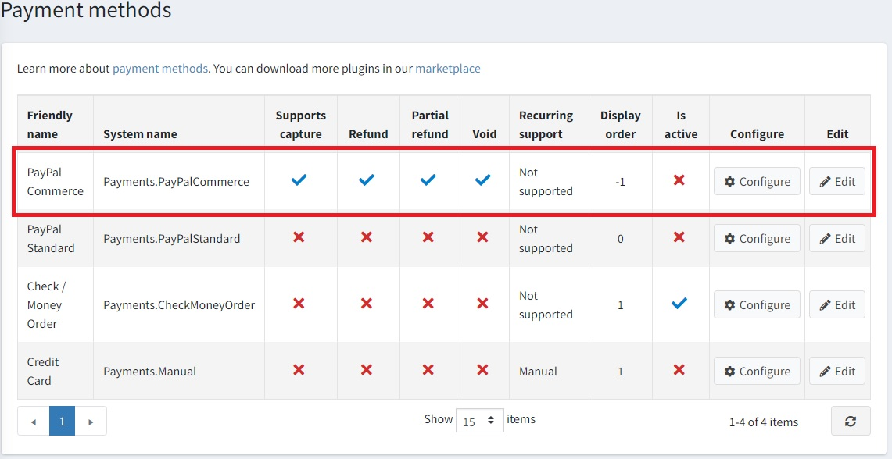
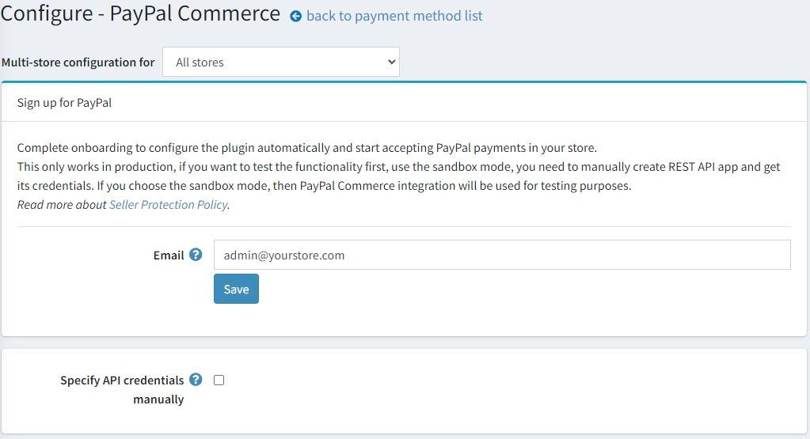
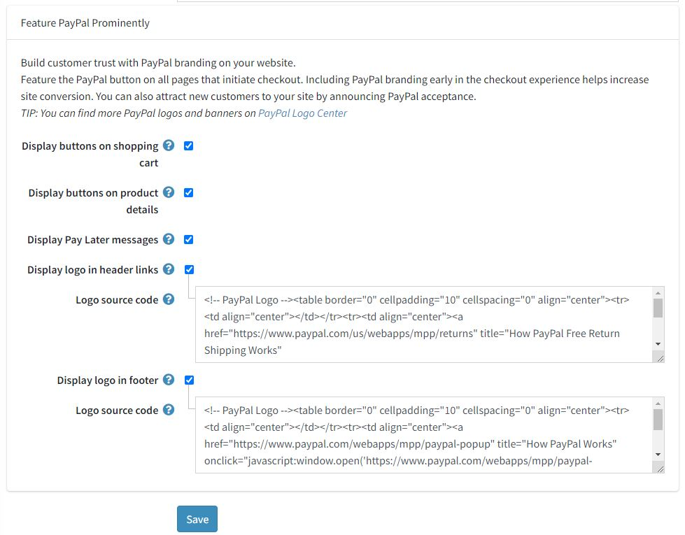
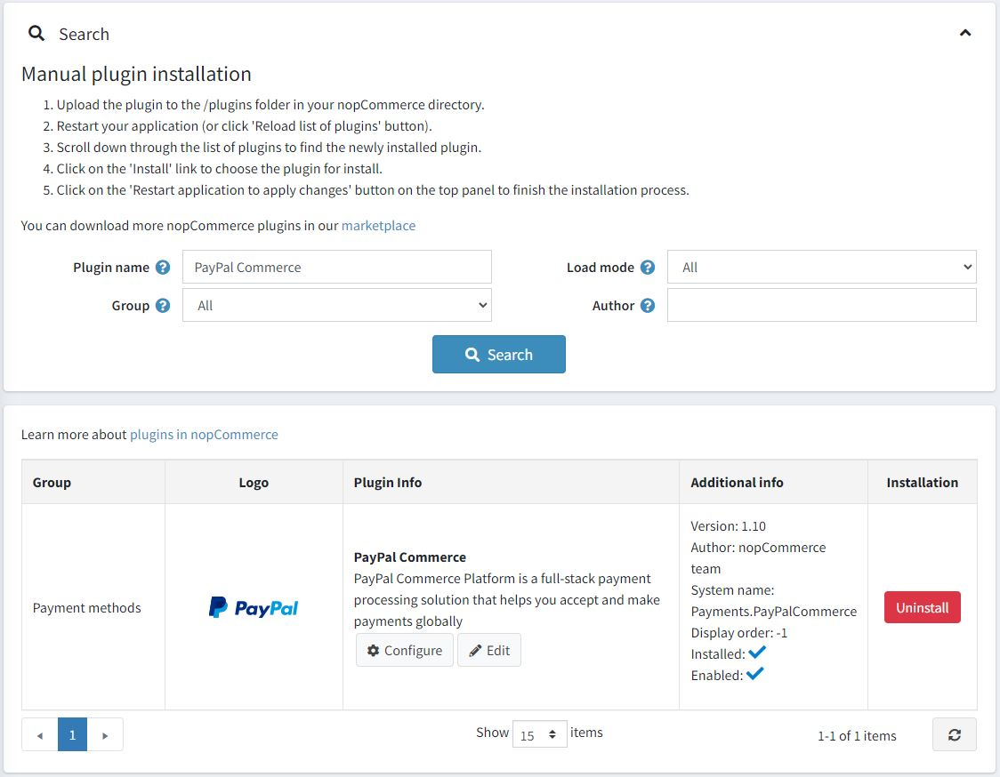
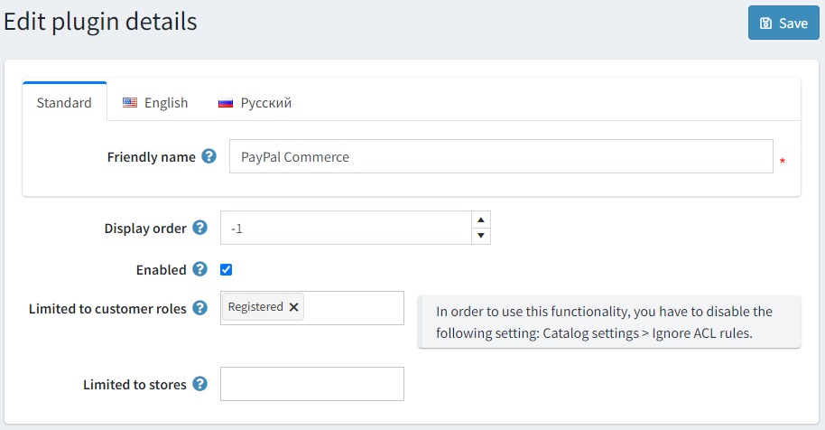

---
title: PayPal Commerce
uid: en/getting-started/configure-payments/payment-methods/paypal-commerce
author: git.DmitriyKulagin
---

# PayPal Commerce

`PayPal Commerce` gives your buyers a simplified and secure checkout experience. PayPal intelligently presents the most relevant payment types to your shoppers automatically, making it easier for them to complete their purchases using such methods as Pay with Venmo, PayPal Credit, credit card payments, iDEAL, Bancontact, Sofort, and other payment types.

## Configure the payment method

To configure the `PayPal Commerce` plugin, go to **Configuration → Payment methods**. Then find the **PayPal Commerce** payment method in the payment method list:

Follow these steps to configure `PayPal Commerce`:

### 1. Activate the payment method

To do this, click the **Edit** button in the plugin row on the payment method list page. Activate the plugin by selecting the **Is active** checkbox. Click the **Update** button. Your changes will be saved.

### 2. Create a PayPal account

If you already have a PayPal account, just proceed to the [next section](#3-set-up-the-paypal-developer-dashboard).

Register a Business account on [PayPal](https://www.paypal.com/us/webapps/mpp/referral/paypal-business-account2?partner_id=9JJPJNNPQ7PZ8). Just click the **Sign up** button there:

Then fill in the information about yourself and your business:

> [!NOTE]
>
> If you already have an account, you will be redirected to the authorization.

### 3. Set up the Paypal Developer Dashboard

1. Log into the [Developer Dashboard](https://developer.paypal.com/developer/applications?partner_id=9JJPJNNPQ7PZ8) with your PayPal account credentials.

1. In **My Apps & Credentials**, use the toggle to switch between live and sandbox testing apps.
    
  
1. Navigate to the *REST API apps* section and click **Create App**.
    

1. Type a name for your app and click **Create App**. The app details page will open and display your credentials.

1. Copy and save the **Client ID** and **Secret** for your app.

1. Review your app details and save your app if you made any changes.

### 4. Configure the payment method in nopCommerce

1. Find the **PayPal Commerce** payment method on the **Configuration → Payment methods** page and click **Configure**. The *Configure - PayPal Commerce* page will be displayed as follows:
    

1. Define the following settings on the *Configure - PayPal Commerce* page:
    * **Specify API credentials manually** - determine if you need to manually set credentials. Select this option if you already have an application created or if you want to use sandbox mode. Otherwise, the plugin will be set up automatically and you will be able to start accepting PayPal payments in your store after completing your PayPal registration.

        

    * **Use sandbox** if you want to test the payment method first.
    * Enter the **Client ID** you saved in the previous steps.
    * Enter the **Secret** you saved in the previous steps.
    * Choose the **Payment type** to either capture payment immediately or authorize payment for an order after order creation.

1. Then proceed to the *PayPal Prominently* panel:
    
  
    On this panel, define the display settings:

      * Select the **Display buttons on shopping cart** checkbox to display PayPal buttons on the shopping cart page instead of the default checkout button.

      * Select the **Display buttons on product details** to display PayPal buttons on product details pages; clicking them matches the behavior of the default 'Add to cart' button.

      * Select the **Display Pay Later messages** box to take advantage of the pay later messaging feature on your website. The message is displayed on the product and checkout pages, showing how much the customer is paying in four installments.

        

      * Tick the **Display logo in header links** checkbox to display a PayPal logo in the header links. These logos and banners are a great way to let your buyers know that you choose PayPal to securely process their payments.
        * If the previous checkbox is selected, the **Logo source code** field is displayed. In this field, enter the source code of the logo. Find more logos and banners on PayPal Logo Center. You can also modify the code to fit correctly into your theme and site style.

      * Tick the **Display logo in footer** checkbox to display a PayPal logo in the footer. These logos and banners are a great way to let your buyers know that you choose PayPal to securely process their payments.
        * If the previous checkbox is selected, the **Logo source code** field is displayed. In this field, enter the source code of the logo. Find more logos and banners on PayPal Logo Center. You can also modify the code to fit correctly into your theme and site style.

Click **Save** to save the plugin settings.

## Limit to stores and customer roles

You can limit any payment method to store and customer role. This means that the method will be available to certain stores or customer roles only. You can do this from the *plugin list* page.

1. Go to **Configuration → Local plugins**. Find the plugin you want to limit. In our case, it's **PayPal Commerce**. To find it faster, use the *Search* panel in the top of the page and search by **Plugin name** or **Group** using the *Payment methods* option.

    

1. Click the **Edit** button, and the *Edit plugin details* window will be displayed as follows:

    

1. You can set up the following limits:

    * In the **Limited to customer roles** field, choose one or several customer roles, that is, administrators, vendors, guests, who will be able to use this plugin. If you don't need this option just leave this field empty.

        > [!Important]
        > In order to use this functionality, you have to disable the following setting: **Catalog settings → Ignore ACL rules (sitewide)**. Read more about the access control list [here](xref:en/running-your-store/customer-management/access-control-list).

    * Use the **Limited to stores** option to limit this plugin to a certain store. If you have multiple stores, choose one or several from the list. If you don't use this option, just leave this field empty.

        > [!Important]
        > In order to use this functionality, you have to disable the following setting: **Catalog settings → Ignore "limit per store" rules (sitewide)**. Read more about multi-store functionality [here](xref:en/getting-started/advanced-configuration/multi-store).

    Click **Save**.
