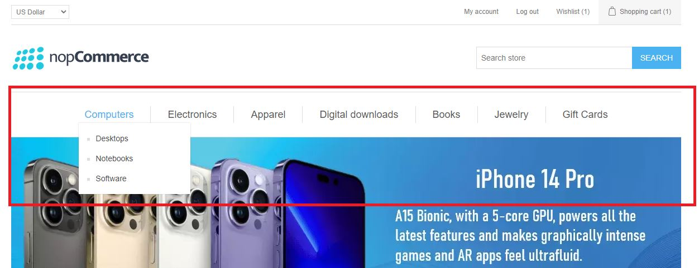
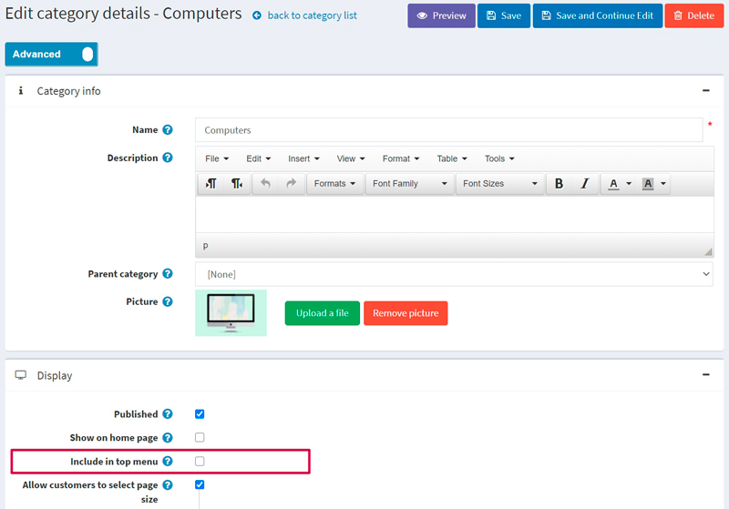
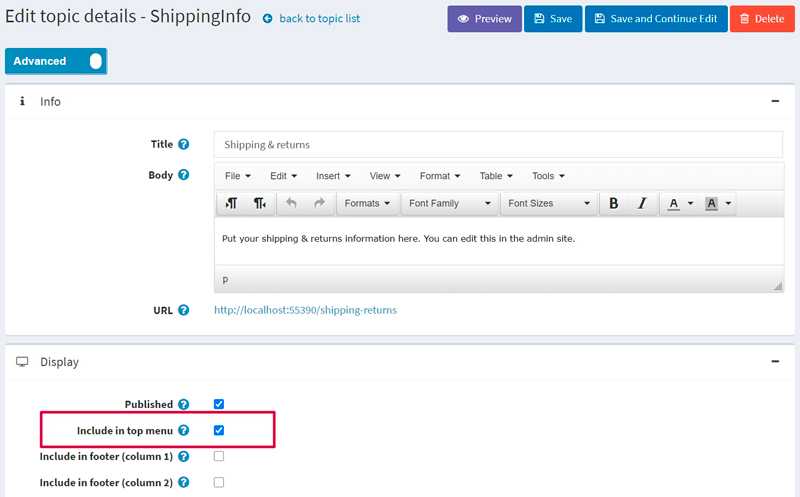
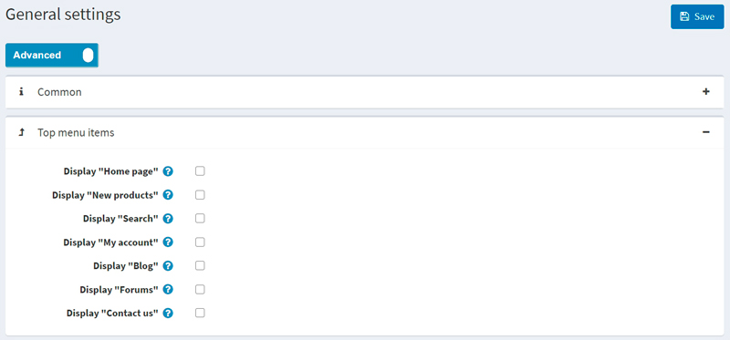
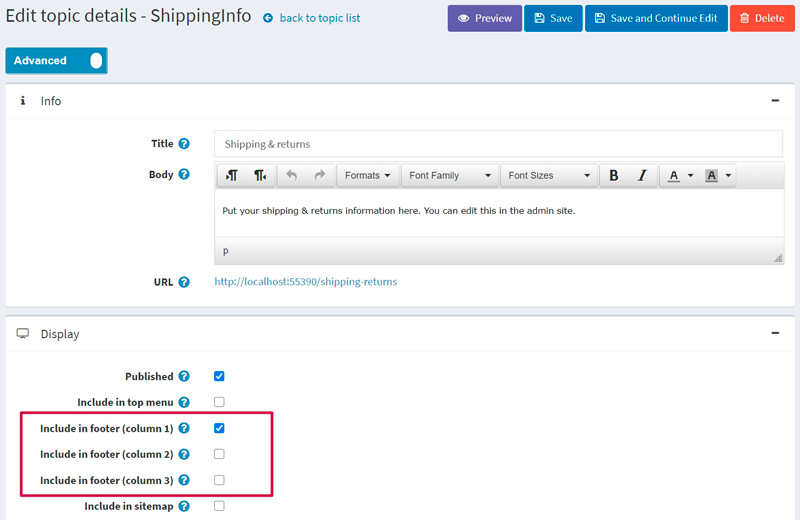
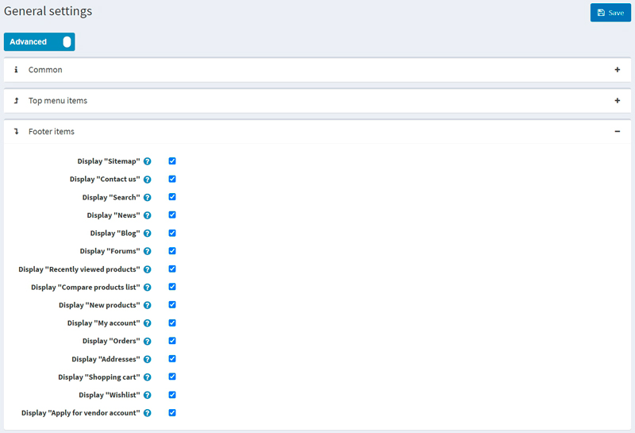
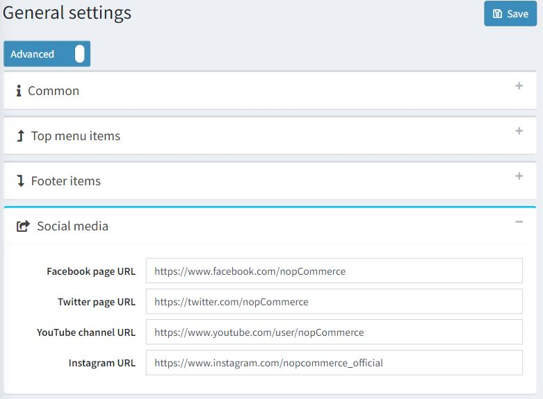
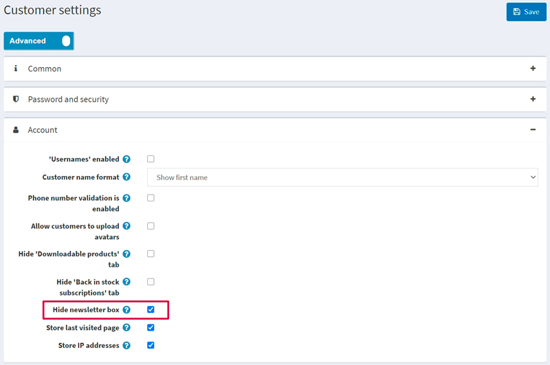

---
title: Top menu & footer
uid: en/getting-started/design-your-store/top-menu-and-footer
author: git.mariannk
---

# Top menu & footer

In nopCommerce, you can choose how the top menu and footer will be displayed. You can include the most important and interesting links in the top menu to attract more customers and add service links to the footer to provide the current store information to your clients.

## Top menu

In the Default Clean theme, the top menu looks as follows:

As you can see, it displays the store categories. Please note, if you want a category to be displayed in the top menu, you should tick the **Include in top menu** checkbox on the category edit page. For more details, read below. 

You can include the following items in the top menu:
- Categories
- Custom topics (pages)
- Links to the site's sections

See below how to add each of these items.

### Categories

To include a category in the top menu, go to the category edit page in the admin area: choose **Catalog → Categories**. Then click the **Edit** button beside the category. The *Edit category details* window will be displayed:

Tick the **Include in top menu** checkbox and click **Save**.

> [!NOTE]
>
> If this category is a subcategory, then ensure that its parent category has this property enabled as well.

### Custom topics (pages)

To include a topic in the top menu, go to the topic edit page in the admin area: choose **Content management → Topics (pages)**. Then click the **Edit** button beside the topic. The *Edit topic details* window will be displayed:

Tick the **Include in top menu** checkbox and click **Save**.

### Links to the site's sections

To include some of the site's sections in the top menu, go to **Configuration → Settings → General settings**. Proceed to the *Top menu items* panel:

Choose the items you want to be displayed in the top menu from the following list: 

* **Display "Home page"**
* **Display "New products"**
* **Display "Search"**
* **Display "My account"**
* **Display "Blog"**
* **Display "Forums"**
* **Display "Contact us"**

Then click **Save**.

> [!NOTE]
>
> The "New products" menu item will only be displayed when the "New products" page is enabled on the **Configuration → Settings → Catalog settings** page (*Additional sections* panel).

## Footer

In the Default Clean theme, the footer looks as follows:

By default, it displays site section links grouped by three types: *Information, Customer service, My account*. You can remove any of the displayed links or add new ones.

You can include the following items in the footer:
- Custom topics (pages)
- Links to the site's sections

See below how to add each of these items.

### Custom topics (pages)

To include a topic in the footer, go to the topic edit page in the admin area: choose **Content management → Topics (pages)**. Then click the **Edit** button beside the topic. The *Edit topic details* window will be displayed:

Choose where you want the topic link to be displayed. You can tick one or more checkboxes:
* **Include in footer (column 1)**
* **Include in footer (column 2)**
* **Include in footer (column 3)**

For example, if you choose **Include in footer (column 1)**, then the link will be displayed in the *Information* column.

Click **Save** to save the changes.

### Links to the site's sections

To include some of the site's sections in the footer, go to **Configuration → Settings → General settings**. Proceed to the *Footer items* panel:

Choose the items you want to be displayed in the footer from the following list: 

* **Display "Sitemap"**
	> [!NOTE]
	>
	> The "Sitemap" menu item will only be displayed when the **Sitemap enabled** checkbox is ticked on the **Configuration → Settings → General settings** page (*Sitemap* panel).

* **Display "Contact us"**
* **Display "Search"**
* **Display "News"**
* **Display "Blog"**
* **Display "Forums"**
* **Display "Recently viewed products"**
	> [!NOTE]
	>
	> The "Recently viewed products" menu item will only be displayed when the "Recently viewed products" page is enabled on the **Configuration → Settings → Catalog settings** page (*Additional sections* panel).

* **Display "Compare products list"**
	> [!NOTE]
	>
	> The "Compare products list" menu item will only be displayed when the "Compare products" functionality is enabled on the **Configuration → Settings → Catalog settings** page (*Compare products* panel).

* **Display "New products"**
	> [!NOTE]
	>
	> The "New products" menu item will only be displayed when the "New products" page is enabled on the **Configuration → Settings → Catalog settings** page (*Additional sections* panel).

* **Display "My account"**
* **Display "Orders"**
* **Display "Addresses"**
* **Display "Shopping cart"**
	> [!NOTE]
	>
	> The "Shopping cart" menu item will only be displayed to a certain customer when the "Public store. Enable shopping cart" permission is enabled for the customer's role. To manage permissions, go to the **Configuration → Access control list** page. Or read more about permissions in the [Access control list](xref:en/running-your-store/customer-management/access-control-list) section.
 
* **Display "Wishlist"**
	> [!NOTE]
	>
	> The "Wishlist" menu item will only be displayed to a certain customer when the "Public store. Enable wishlist" permission is enabled for the customer's role. To manage permissions, go to the **Configuration → Access control list** page. Or read more about permissions in the [Access control list](xref:en/running-your-store/customer-management/access-control-list) section.

* **Display "Apply for vendor account"**
	> [!NOTE]
	>
	> The "Apply for vendor account" menu item will only be displayed when the **Allow customers to apply for vendor account** checkbox is ticked on the **Configuration → Settings → Vendor settings** page (*Common* panel).

Click **Save** to save the changes.

### Follow us

To customize the **Follow us** block of the footer, go to **Configuration → Settings → General settings**. Proceed to the *Social media* panel as follows:

Enter your social media links:

- **Facebook page URL**
- **Twitter page URL**
- **Instagram page URL**

If you want to enable/disable the RSS link in the footer, you need to enable/disable news accordingly on the **Configuration → Settings → News settings** page (*Common* panel).

### Newsletter

The newsletter block is displayed in the footer by default. To hide this block, go to **Configuration → Settings → Customer settings**. Proceed to the *Account* panel and tick the **Hide newsletter box** checkbox as follows:

Click **Save** to save the changes. The footer will be updated accordingly.

### Powered by nopCommerce

According to the terms of the nopCommerce license, without purchasing the *Copyright removal key*:

- You may NOT remove or hide the "Powered by nopCommerce" statement that appears at the bottom of each page within a nopCommerce-powered website
- When users click on the "Powered by nopCommerce" text, it must direct them to https://www.nopcommerce.com. The "Powered by nopCommerce" link must be in the same format, unedited, as delivered in the program source code. This obligation shall also apply to any copies or derivative works!
- The copyright notice at the footer of your store (website) must remain intact, unedited, and clearly visible. Please do NOT attempt to edit, remove or hide the copyright notice in any way.

Upon purchase of a "copyright removal key," you are permitted to remove the "Powered by nopCommerce" statement.
Copyright infringement is illegal — please be advised.

For more information, please visit the [nopCommerce copyright removal key](https://nopcommerce.com/nopcommerce-copyright-removal-key?utm_source=documentation&utm_medium=link&utm_campaign=powered_by_nopcommerce&utm_content=topmenu_footer) page.
