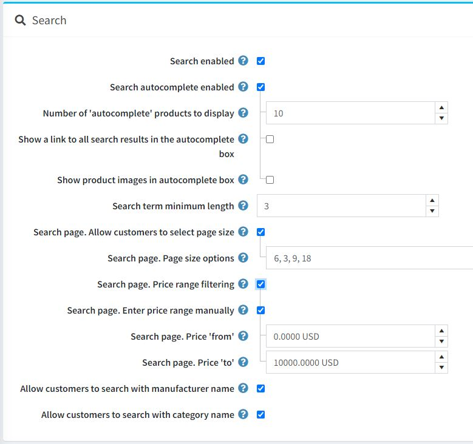
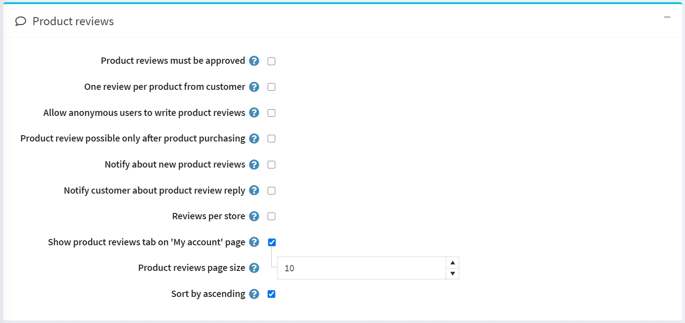
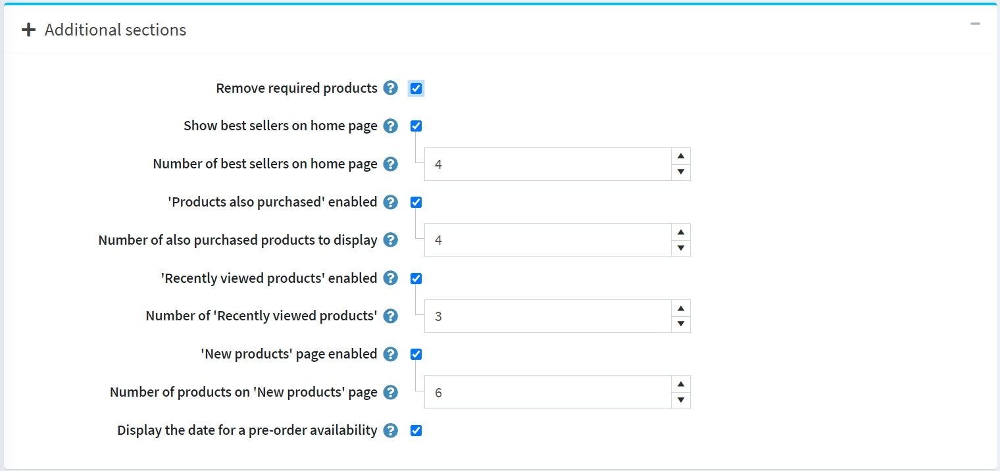
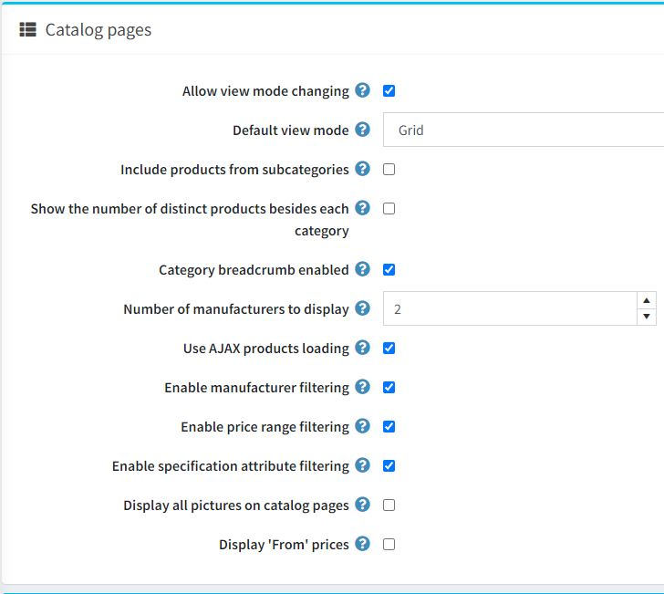
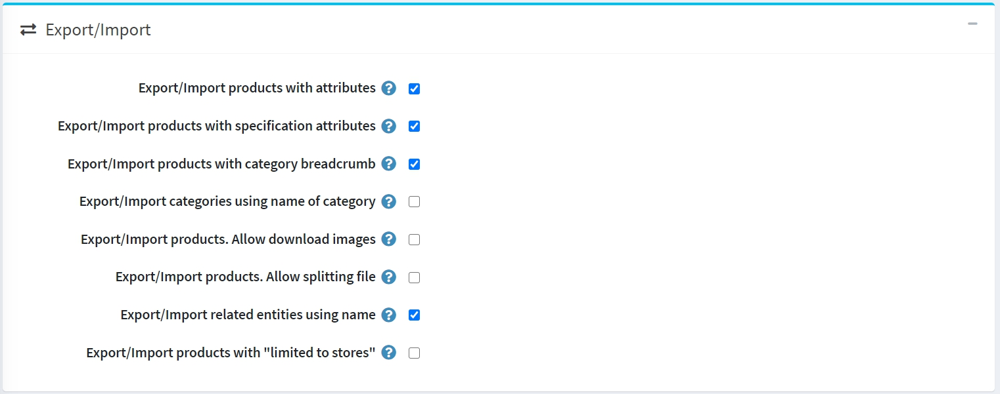
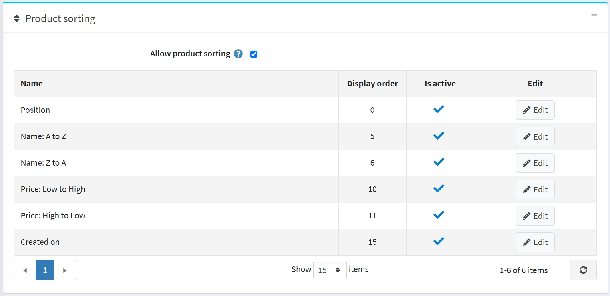

# Catalog settings

Catalog settings include enabling options for product sorting, changing view modes, comparing products, and more.

To define catalog settings, go to **Configuration → Settings → Catalog settings**. The catalog settings page is available in *advanced* and *basic* modes (advanced mode by default).

This page enables multi-store configuration; it means that the same settings can be defined for all stores or differ from store to store. If you want to manage settings for a certain store, choose its name from the multi-store configuration dropdown list and select all the checkboxes needed on the left to set custom values for them. For further details, refer to [Multi-store](xref:en/getting-started/advanced-configuration/multi-store).

## Set up a search

The top panel on the page sets up *Search*:

- Select the **Search enabled** checkbox if you want the search functionality to be enabled in the public store.
- Select the **Search autocomplete enabled** checkbox to display the autocomplete search box in the public store as follows:

  

  When this option is enabled, the following additional fields will be displayed:

  - **Number of 'autocomplete' products to display** sets up the number of results that will be visible in the autocomplete dropdown list of the search box in the public store.
  - Select the **Show a link to all search results in the autocomplete box** checkbox to display the link to all results in the autocomplete search box. Displayed if the number of items found is greater than the displayed quantity in the autocomplete box.
  - Select the **Show product images in autocomplete box** checkbox to enable displaying product images in the autocomplete search box.

- **Search term minimum length** is a minimum number of chars required for the search.
- Select the **Search page. Allow customers to select page size** checkbox if you want to allow customers to select the page size from the predefined list of options.
  - In the **Search page. Page size options** field, enter a comma-separated list of page size options for customers or the number of products that you want to display on the search products page.
  - If the **Search page. Allow customers to select page size** setting is disabled, the **Search page. Products per page** field will be displayed. In this field, enter the number of products you want to be displayed on the search page.
- Select the **Search page. Price range filtering** checkbox if you want to enable filtering by price range.
  - If you want the price range to be entered manually, select the **Search page. Enter price range manually** checkbox.
    - If the setting above is enabled, enter the **Search page. Price 'from'**.
    - And the **Search page. Price 'to'**.
- If the **Allow customers to search with manufacturer name** is enabled, customers can search by manufacturer name.
- If the **Allow customers to search with category name** is enabled, customers can search by category name.

## Product reviews

The second panel sets up *Product reviews*. Define the following:

- **Product reviews must be approved** to enforce product reviews to be approved by the store administrator prior to being published.
- **One review per product from customer** to restrict customer to add just 1 review per product.
- **Allow anonymous users to write product reviews** to allow anonymous users to write product reviews.
- **Product review possible only after product purchasing** to allow reviewing the product only by customers who have already ordered it.
- **Notify about new product reviews** to notify the store owner about new public reviews.
- **Notify customer about product review reply** to notify a customer about product review reply.
- **Reviews per store** allows only displaying reviews of the current store (on the product details page). Clear this checkbox if you want your customers to see the product's reviews written in all of your stores.
- **Show product reviews tab on 'My account' page** to allow customers to see all their reviews on the 'My account' page.
- **Product reviews page size** is the number of reviews per page.
- **Sort by ascending** to sort product reviews by creation date in ascending order.

## Review types

The next block sets up *Review types*. You can configure a list of review types if you think that a basic review is not enough.

Click **Add new button** to create a new review type.

Define the following:

- Enter your review type **Name**.
- Enter the review type **Description**.
- Define the **Display order**.
- When **Required**, customers have to choose an appropriate rating value before they can continue.
- **Visible to all customers** sets the visibility of the review type to all customers.

Click the **Save** button to add a new review type.

Now customers will be able to fill additional ratings on the product review page in the public store.

On this page, you can also see the feedback left by all customers (if this setting is active). On the customer personal account page, there is also an opportunity to view all the reviews left for the products.

## Performance

The next panel sets up *Performance*. Having the following settings enabled can significantly improve the store performance:

- **Ignore ACL rules (sitewide)** turns off the [ACL rules](xref:en/running-your-store/customer-management/access-control-list) configured for entities.
- **Ignore limit per store (sitewide)** allows ignoring limit per stores rules configured for entities. It is recommended to enable this setting if you only have one store or no store-specific limitations. Read more about multi-store in the [Multi-store](xref:en/getting-started/advanced-configuration/multi-store) section.
- **Ignore discounts (sitewide)**.
- **Ignore featured products (sitewide)**.
- **Cache product prices**. You should not enable it if you use complex discounts, discount requirement rules or coupon codes.

## Share

Sharing options in the *Share* panel allow to set up an opportunity for shoppers to share the products across their social media networks. The options will appear as small icons on product pages. To set up the sharing options:

- Select the **Show a share button** to display a share button on the product details page. When this field is selected, the **Share button code** field will be displayed.
- The **Share button code** field displays the page's button code.

  > [!TIP]
  >
  > By default, the AddThis service is used ([http://www.addthis.com/](http://www.addthis.com/)).

This is what share links look like:

- Select the **'Email a friend' enabled** checkbox to allow customers to use the "Email a friend" option.
- **Allow anonymous users to email a friend** if needed.

## Compare products

Compare products option enables customers to compare various offers based on their characteristics and prices so that they can make the best shopping decisions. Set up the *Compare products* block as follows:

- Select the **'Compare products' enabled** checkbox to enable customers to compare product options in your public store. The *Add to compare list* button will appear on product pages.
- Select the **Include short description in compare products** checkbox to display short product descriptions on the compare products page.
- Select the **Include full description in compare products** checkbox to display full product descriptions on the compare products page.

## Additional sections

The *Additional sections* panel allows you to set the following options:

- Select the **Remove required products** checkbox to automatically remove the required product from the cart when the main product is removed.
- **Show best sellers on home page** allows you to show bestsellers on the home page.
  - If the previous checkbox is selected, you will be able to enter the **Number of best sellers on home page**.
- Select the **'Products also purchased' enabled** checkbox to enable customers to view a list of products also purchased by those who purchased the above.
  - When the previous option is enabled, the **Number of also purchased products to display** field will appear. Here, the store owner can set the number of products to be displayed.
- Select the **'Recently viewed products' enabled** checkbox to enable customers to see products recently viewed in your store.
  - In the **Number of 'Recently viewed products'** field, enter the number of recently viewed products to be displayed when the previous checkbox is selected.
- Select the **'New products' page enabled** checkbox if you want the 'New products' page to be enabled in the store.
  - In the **Number of products on 'New products' page** field, enter the number of recently added products to display when the *'New products' page enabled* is selected.
- Select the **Display the date for a pre-order availability** checkbox if needed.

## Product fields

In the *Product fields* panel, you can set the following options:

- **Show SKU on product details page**.
- **Show SKU on catalog pages**.
- **Show GTIN** in the public store.
- **Show manufacturer part number** in the public store.

## Product page

In the *Product page* panel, you can set the following options:

- **Show "free shipping" icon** for products with this option enabled.
- **Allow viewing of unpublished product details page**. In this case, SEO will not be affected, and search crawlers will index the page, even though a product is temporarily unpublished and invisible to customers. Note that a store owner always has access to unpublished products.
- Select the **Discontinued message for unpublished products** checkbox to display the "a product has been discontinued" message when customers try to access details pages of unpublished products.
- Select the **Display type for attribute value when out of stock**. If the attribute combination is out of stock, you can show it as disabled or as usual.

  > [!NOTE]
  >
  > Note that the **Allow only existing attribute combinations** option should be enabled for a product.

## Catalog pages

The *Catalog pages* panel enables you to set:

- **Allow view mode changing** on the categories and manufacturers pages.
- The **Default view mode** to either *Grid* or *List*.
- **Include products from subcategories** when viewing a category details page.
- To **Show number of distinct products beside each category** in the category navigation area located in the left column in the public store.
  - If needed, turn on the **Show the number of distinct products besides each category** setting.
- **Category breadcrumb enabled**. Select to enable the category path (breadcrumb). This is the bar at the top of the screen that indicates in which categories and subcategories the product was viewed on the product pages. Each subelement of the bar is a separate hyperlink.
- **Number of manufacturers to display** in the manufacturer navigation block.
- **Use AJAX products loading** to load products asynchronously (applicable to 'paging,' 'filtering,' 'view modes') on catalog pages.
- **Enable manufacturer filtering** to enable the manufacturer filtering on catalog pages.
- **Enable price range filtering** to enable the price range filtering on catalog pages.
- **Enable specification attribute filtering** on the catalog pages if needed. If turned off, the specification attribute filtering won't be displayed on the catalog pages even if you have such attributes created.
- **Display all pictures on catalog pages** - On the pages of the catalog it becomes possible to view all the pictures of the product.
- **Display 'From' prices** - Check to display 'From' prices on catalog pages. This will display the minimum possible price of a product based on price adjustments of attributes and combinations instead of the fixed base price. If enabled, it is also recommended to enable setting 'Cache product prices'. But please note that it can affect performance if you use some complex discounts, discount requirement rules, etc.

## Tags

In the *Tags* panel, you can define:

- **Number of product tags (cloud)** — the number of tags that appear in the tag cloud.
- To **Allow customers to select 'Products by tag' page size** on the product tag page from a list of options predefined by the store owner. When disabled, customers will not be able to select page size, and the store owner enters it.
  - If the previous option is selected, the **'Products by tag' page size options** field becomes visible. You can enter values that can be selected by shop users. Numbers should be separated with commas. The first value will be the default.
  - If the **Allow customers to select 'Products by tag' page size** setting is disabled, the **'Products by tag' page. Products per page** field will be displayed. In this field, enter the number of products you want to be displayed on the search page.
- Select the **'Products by tag' page. Price range filtering** checkbox if you want to enable filtering by price range.
  - If you want the price range to be entered manually, select the **'Products by tag' page. Enter price range manually** checkbox.
    - If the setting above is enabled, enter the **'Products by tag' page. Price 'from'**.
    - And the **'Products by tag' page. Price 'to'**.

## Tax

Some tax/shipping info options specific to Germany are available in the *Tax* panel:

- **Display tax/shipping info (footer)**.
- **Display tax/shipping info (product details page)**.
- **Display tax/shipping info (product boxes)**.
- **Display tax/shipping info (shopping cart)**.
- **Display tax/shipping info (wishlist)**.
- **Display tax/shipping info (order details page)**.

## Export/import

In the *Export/import* panel, you can define:

- Select the **Export/import products with attributes** checkbox if you need product attributes to be exported/imported whenever you export/import the product.
- Select the **Export/import products with specification attributes** checkbox if products should be exported/imported with specification attributes.
- Select the **Export/import products with category breadcrumb** checkbox if products should be exported/imported with full category names including names of all its parents.
- Select the **Export/import categories using name of category** checkbox if categories should be exported/imported using the category names.
- Select the **Export/import products. Allow download images** checkbox if images can be downloaded from a remote server when exporting products.
- Select the **Export/import products. Allow splitting file** checkbox if you want to import products from individual optimal-size files automatically created from the main file. This function will help you import a large amount of data with a smaller delay.
- Select the **Export/import related entities using name** checkbox if related entities should be exported/imported using names.
- Select the **Export/import products with "limited to stores"** checkbox if products should be exported/imported with their "limited to stores" properties.

## Product sorting

In the *Product sorting* panel, you can define:

- Select the **Allow product sorting** checkbox to enable a product sorting option on the categories and manufacturers pages. You can activate/deactivate sorting by *Position*, *Name*, *Price*, and *Date of creation*.

  

  You can edit the **Display order** and **Is active** property of each option by clicking the **Edit** button.
