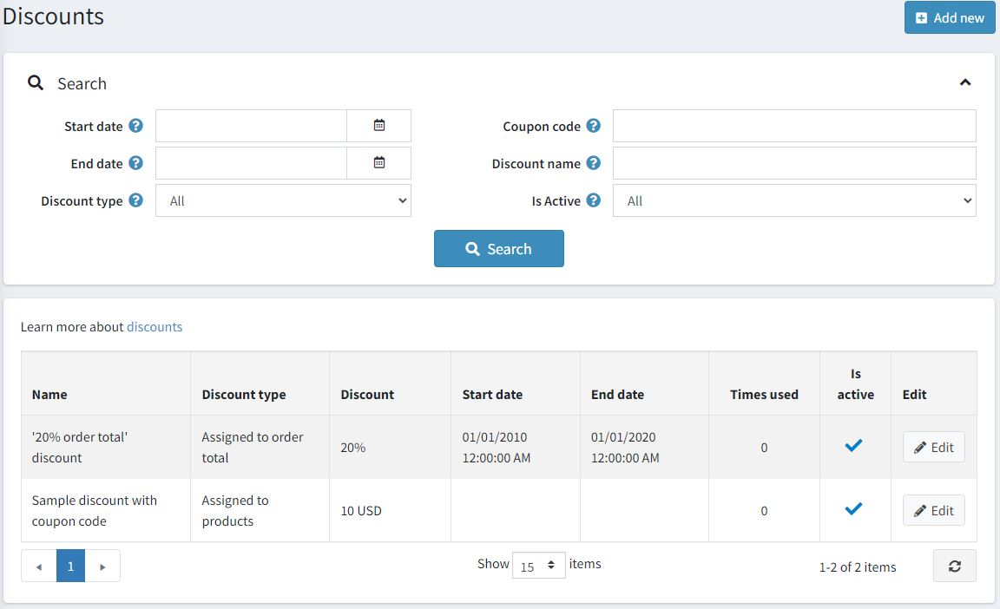
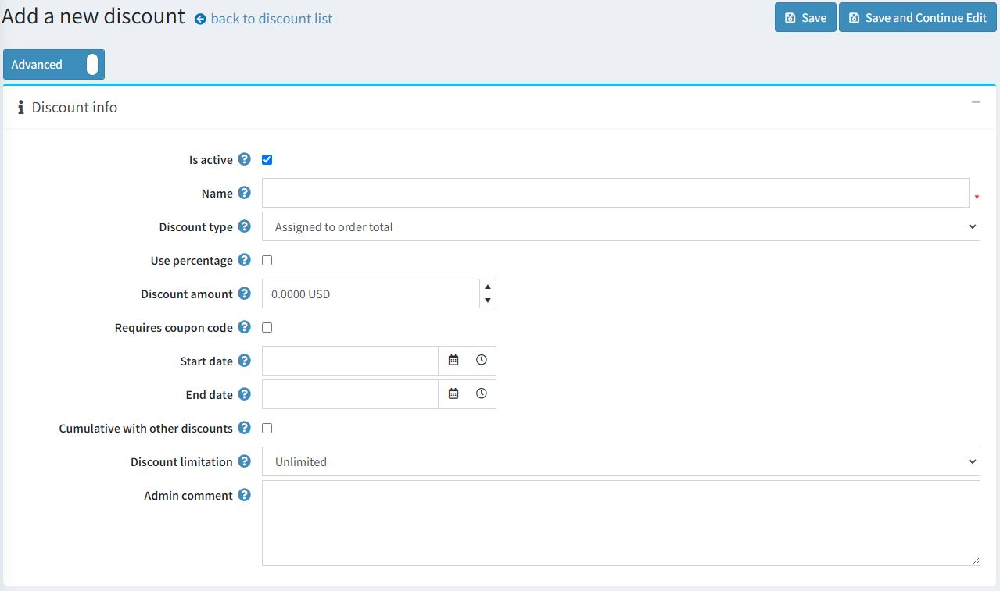

---
title: Discounts
uid: en/running-your-store/promotional-tools/discounts
author: git.AndreiMaz
contributors: git.exileDev, git.DmitriyKulagin, git.IvanIvanIvanov, git.mariannk
---

# Discounts

In nopCommerce you can use discounts to enable access to special offers. They can be applied to certain categories, products, to the total amount and so on. You can use different requirements available out of the box and via plugins from [nopCommerce marketplace](http://www.nopcommerce.com/marketplace) for applying to your discounts.

Products in nopCommerce can have any number of discounts attached. In case of several discounts applied, nopCommerce will automatically calculate the best possible price for the customer based on all the available discounts and group memberships.

The most common way of using the discounts is a coupon code. The coupon code is entered by your customer on the shopping cart page just before checking out.

To see the list of discounts go to **Promotions → Discounts** page:

The top area of the page enables you to search for a discounts by different search criteria:

- **Start date** and **End date** for discounts created between these dates.
- **Discount type**.
- **Coupon code**.
- **Discount name** is a full discount name or a part of the discount name.

> [!NOTE]
>
> By default, there are no discounts available in nopCommerce, so you can create them from scratch and follow your own marketing strategy.

## Adding new discount

To add a new discount go to **Promotions → Discounts** and click **Add new**.

This page is available in two modes: advanced and basic. Stay in the basic mode which displays the only main fields or switch to the advanced mode displaying all the available fields.

- Enter the **Name** of the discount.
- From the **Discount type** dropdown list, assign the discount to the required option, as follows:
  - *Assigned to order total*: these discounts are applied to the entire customer order (order total).
  - *Assigned to products*: after this discount is created, the store owner can assign this discount to a product on the product details page or add products in the *Applied to products* panel which will be displayed below after you save the new discount.
  - *Assigned to categories*: after this discount is created, the store owner can assign this discount to a category on the category edit page or add categories in the *Applied to categories* panel which will be displayed below after you save the new discount. This enables the discount to be applied to all products in this category.
    - If selected the **Apply to subcategories** field will be displayed to allow applying this discount to subcategories.
  - *Assigned to manufacturers*: after this discount is created, the store owner can assign this discount to a manufacturer on the manufacturer edit page or add manufacturer in the *Applied to manufacturer* panel which will be displayed below after you save the new discount. This enables the discount to be applied to all products in this manufacturer.
  - *Assigned to shipping*: these discounts are applied to the shipping fee.
  - *Assigned to order subtotal*: these discounts are applied to the order subtotal value.

- Tick the **Use percentage** checkbox if you want to apply a percentage discount.
  - If the previous checkbox is ticked the **Discount percentage** field will be displayed.
  - You can also set the **Maximum discount amount**. Leave this field empty to allow any discount amount. If you're using *Assigned to products* discount type, then it's applied to each product separately.

- You can apply **Discount amount** to the order or SKU if the **Use percentage** checkbox is not ticked.
- Tick the **Requires coupon code** checkbox, to enable a customer to supply a coupon code for the discount to be applied.
  - After ticking the checkbox the **Coupon code** option appears. You can enter the required coupon code in this field. This enables customers to enter this coupon code during checkout to apply the discount.
    > [!NOTE]
    >
    > A customer can apply an unlimited number of coupon codes to one order if they fit it.

- If you want to specify the **Start date** and the **End date** for your discount, select them in the calendar field in Coordinated Universal Time (UTC).
- The **Cumulative with other discounts** option allows customers use several discounts at the same time. If checked, this discount can be used with other ones simultaneously.
  > [!NOTE]
  >
  > This feature works only for discounts with the same discount type. Right now, discounts with distinct types are already cumulative.

- You can also limit the number of times the discount will be used. From the **Discount limitation** dropdown list, select the required limitation regarding the discount:
  - *Unlimited*.
  - *N times only*: select this option and enter the number of times this discount will be available.
  - *N times per customer*: select this option and enter the number of times this discount will be available for one customer.

- In the **Maximum discounted quantity** field (only visible when the **Discount type** is set to *Assigned to products*, *categories* or *manufacturers*) specify the maximum product quantity which could be discounted. It can be used for scenarios like "buy 2 get 1 free".
- Enter the **Admin comment** if needed. It is not visible for customers.

Click **Save** to save the changes or click **Save and continue edit** to proceed to editing other panels.

## Adding discount requirements

After creating the discount it's allowed to add discount requirements if you want some specific rules to be applied to the discount.
Set up requirements if you want to limit the discount to certain user categories depending on a customer role, the amount spent, etc. You can use single requirement type, or group several types and apply them simultaneously.

To add discount requirements go to *Requirements* panel:

To add a new requirement select the **Discount requirement type** from the dropdown list.

- There is one requirement type available in nopCommerce out of the box: *Must be assigned to a customer role*. This allows you to configure discounts for certain customer groups (roles). Other requirements are available as plugins on our [marketplace](https://www.nopcommerce.com/en/extensions?searchterm=discount+requirement&category=discounts-promotions).

- Also, you can create a group of requirements to deal with complex requirements with multiple rules. Requirement group is a useful feature for creating discount requirement templates. You can create a requirement group just once and then use it every time you want this limitation to be applied. You can include one requirement group into another one if needed.
  The requirements are set using boolean logic. For instance, if you want the discount to be assigned to a particular customer role or in case a customer had spent a certain amount. Such requirements and more are available as plugins on our [marketplace](https://www.nopcommerce.com/en/extensions?searchterm=discount+requirement&category=discounts-promotions).

You can set an unlimited number of requirement groups, one inside another. For example, more complex case, when you want you customers get a discount if they are vendors and had spent a certain amount or if they are forum moderators and they put a certain product to the cart at the same time.

When customers apply a discount while proceeding to the checkout, it is displayed, as follows:

## Common type of discounts

### Black Friday sale

Black Friday is always the day after Thanksgiving. It's quite common discount campaign, almost every online store has a Black Friday sale.

- **Name** - you can enter any name, it's only internal.
- **Discount type** - here it's *Assigned to subtotal* type when a discount is applied to the whole order amount before all the fees are added (like shipping fee and taxes). It's relevant here because we want all the products in the cart to be discounted.
- We can apply the discount in % or just enter the amount in chosen currency. We have 10% here.
- The **Maximum discount amount** can be limited as well, so even if the total amount of products in the cart will be $300 a customer will only have 10$ discount anyway.
- This discount will require a **Coupon code**. You can apply discounts without entering coupon codes, but it's not recommended considering marketing purposes. Coupon codes allow you to check campaigns results.
- Frequently discounts are time-based. Here we entered Black Friday weekend dates in the **Start date** and **End date** fields.
- **Cumulative with other discounts** option allows customers use several discounts at the same time.
- The last setting is for **Discount limitation** usage. For instance, this discount can be applied once per customer.

### Buy one item and get 50% on the second

Often you need to sell more items of the certain product. In this case, to encourage your customers to buy several items of that, you can offer them a discount. Let's see how to use the discount "Buy one item and get 50% on the second" in your nopCommerce store.

- The **Discount type** is *Assigned to products*. In *Applied to products* panel you can add them, here will be an "Oversized T-shirt".
- We want our customers to get 50% discount on the 2nd t-shirt.
- This discount can be used once per customer, so the **Maximum discounted quantity** is 1.
- You can set up requirements to the product quantity in *Requirements* panel. Add a requirement type *Customer has all of these products* and add T-shirt with a quantity 2. This requirement type can be dowloaded as a plugin [here](https://www.nopcommerce.com/en/has-all-products-discount-requirement-rule).     Read how to install plugins in the [Plugins](xref:en/getting-started/advanced-configuration/plugins-in-nopcommerce) section.

You can use this scenario to set up other popular discount - "Buy one and get the second for free" if you set up a 100% discount.

## See also

- More plugins on discount types and discount requirement types on [nopCommerce marketplace](http://www.nopcommerce.com/marketplace)
- How to [install plugins](xref:en/getting-started/advanced-configuration/plugins-in-nopcommerce)

## Tutorials

- [Using discounts in nopCommerce](https://www.youtube.com/watch?v=cAXxnV79dzw&index=7&list=PLnL_aDfmRHwsbhj621A-RFb1KnzeFxYz4)
- [Configuring discounts with boolean logic](https://www.youtube.com/watch?v=gBtZG3OcjnQ)
